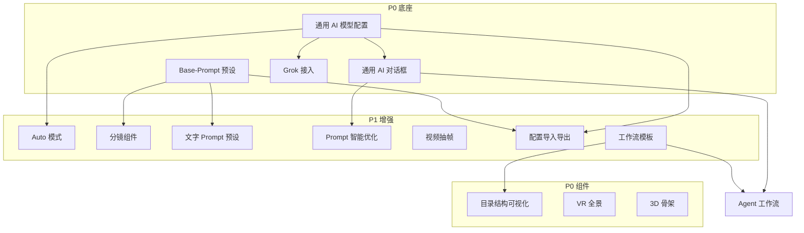

# 产品设计 TODO-LIST

> 面向 Storyboard Copilot 的中长期产品路线图。P0 为当前阶段优先项；其余按依赖与价值排序。  
> 实现时拆分到 `changes/<slug>.md` 做迭代验收。

## 优先级说明

| 标记 | 含义 |
|------|------|
| **P0** | 当前阶段必做，阻塞核心体验或差异化能力 |
| P1 | 高价值，可在 P0 底座就绪后并行推进 |
| P2 | 增强型能力，依赖前置模块 |

## 现状基线（2026-06）

- 已有：节点画布、上传/AI 出图/裁剪标注/分镜切割与生成、多供应商 API Key 配置（kie / ppio / fal / grsai）、模型参数控件。
- 缺口：统一模型配置中心、全局 prompt 预设、目录可视化、VR/3D 组件、通用对话、配置导入导出、工作流模板与 Agent。

---

## 一、AI 基础设施

### [P0] 通用 AI 模型配置中心

**目标**：一套可视化配置体系，覆盖主流供应商与模型，并支持用户自定义增删改；交互参考 [CC Switch](https://github.com/farion1231/cc-switch) 的 Provider 管理范式。

**参考 CC Switch 的用法要点**：

- 内置 50+ 供应商/模型预设，一键导入（填 API Key 即可启用）
- 可视化列表：启用/禁用、拖拽排序、分组管理
- 单条配置包含：名称、Base URL、模型 ID、鉴权方式、能力标签（生图/视频/LLM）
- 配置导入/导出（JSON），便于备份与跨设备迁移
- 可选：本地代理 / 故障转移（后续 P1）

**与现状差异**：

- 当前模型定义分散在代码注册表 + 设置页 API Key；用户无法自行新增 OpenAI 兼容网关或改模型参数模板
- 需抽象「模型配置 schema」，与运行时 `resolveRequest` / Rust provider 解耦

**验收**：

- [ ] 设置页独立「模型与供应商」分类，列表展示全部已配置项
- [ ] 可从预设库一键添加；可手动新建/编辑/删除自定义配置
- [ ] 节点选模型时下拉仅展示「已启用且 Key 有效」的项；缺 Key 时有明确引导
- [ ] 内置主流模型（生图/视频/LLM）的默认参数模板（比例、分辨率、模式说明）
- [ ] 配置持久化到本地 SQLite，与项目数据分离

**主要改动路由**：`settingsStore`、设置 UI、`models/` 注册机制、`src-tauri/src/ai/` provider 解析

---

### [P0] Grok 免费生图 / 视频接入

**目标**：接入 xAI Grok 免费或低成本生图、生视频能力，作为预设供应商之一纳入上述配置中心。

**验收**：

- [ ] Grok 出现在预设供应商库，文档链到 `docs/api_docs/`
- [ ] 支持至少一种生图与一种视频模型（按官方 API 能力裁剪）
- [ ] 图像/视频节点可选 Grok 模型并完成生成

**依赖**：通用 AI 模型配置中心（或最小可用的预设 + Key 配置）

---

### Auto 模式（智能选模型）

**目标**：应用内置各场景的 prompt / 能力需求描述；用户选「Auto」时，系统自动匹配最合适的已启用模型。

**交互**：

- 使用前展示「本次将使用：xxx 模型（原因：分镜一致性 / 视频生成 / …）」
- 若缺少 API Key：阻断并跳转配置，明确列出缺失的 provider

**验收**：

- [ ] 图像节点、分镜生成、对话等入口可选 Auto
- [ ] 匹配规则可配置（内置 JSON + 后续用户可调优先级）
- [ ] 缺 Key / 缺模型时错误信息 actionable

**依赖**：通用 AI 模型配置中心  
**优先级**：P1

---

### [P0] 通用 AI 对话框

**目标**：全局可用的 AI 对话面板，支持选模型、多轮上下文、引用当前项目/选中节点上下文（后续扩展）。

**验收**：

- [ ] 从标题栏或快捷键打开，不遮挡画布核心操作
- [ ] 可选择已配置的 LLM 模型
- [ ] 对话历史会话级持久化（可选）
- [ ] 支持复制回复、插入到文字节点

**依赖**：通用 AI 模型配置中心（LLM 部分）

---

### Agent 升级（基于通用对话框）

**目标**：在通用对话框基础上升级为 Agent：理解画布状态，帮用户搭建/执行工作流（创建节点、连线、触发工具、批量出图等）。

**验收**：

- [ ] 用户用自然语言描述目标，Agent 输出可执行步骤并征求确认
- [ ] 可一键应用为画布上的节点组 + 连线模板
- [ ] 执行过程可观测、可中断

**依赖**：通用 AI 对话框、工作流模板（见第六节）  
**优先级**：P2

---

## 二、Prompt 与风格统一

### [P0] 预设 Base-Prompt（画风 / 人物 / 场景）

**目标**：项目级或全局级 prompt 预设库，用于统一视觉风格、人物设定、场景基调；生成类节点可一键挂载。

**预设类型示例**：

| 类型 | 用途 |
|------|------|
| 画风 | 赛博朋克、水彩、电影感 2.35:1 … |
| 人物 | 角色外貌、服装、年龄、气质 |
| 场景 | 室内/室外、时段、天气、氛围 |

**验收**：

- [ ] 设置页或项目侧栏管理预设：增删改、启用默认
- [ ] 图像节点 / 分镜生成可选择挂载一项或多项 base-prompt（合并策略可配置：前缀 / 结构化块）
- [ ] 预设随项目保存或可选「全局预设库」

**优先级**：P0

---

### 文字组件 Prompt 预设

**目标**：`textAnnotationNode` 等文本类节点支持 prompt 模板（分镜脚本、镜头描述、对白格式等），用户可自定义。

**验收**：

- [ ] 文本节点工具条可选模板插入
- [ ] 模板库与 base-prompt 共用或独立管理（产品决策：建议共用「Prompt 库」分类）

**依赖**：Base-Prompt 基础设施  
**优先级**：P1

---

### 文本组件 Prompt 智能优化

**目标**：所有文本相关输入框提供「智能优化」：根据节点类型与上下文，用 LLM 改写/扩写/结构化 prompt。

**验收**：

- [ ] 图像节点 prompt、文字节点内容、分镜描述等均有优化入口
- [ ] 优化前后 diff 预览，用户确认后应用

**依赖**：通用 AI 对话框 / LLM 配置  
**优先级**：P1

---

## 三、画布与媒体组件

### [P0] 工作台目录结构可视化

**目标**：以树形/层级视图展示当前项目的节点组织（分组、命名、类型），支持定位、重命名、拖拽调整层级（与画布双向同步）。

**验收**：

- [ ] 侧栏或独立面板展示项目内节点树（含 group 嵌套）
- [ ] 点击条目定位并选中画布节点
- [ ] 重命名、删除、移动分组与画布一致
- [ ] 大项目（100+ 节点）滚动与搜索性能可接受

**优先级**：P0

---

### 分镜组件（需求 → 分镜提示词）

**目标**：输入故事/镜头需求，自动生成分镜脚本与每格 prompt，并对接现有 `storyboardGen` / `storyboardSplit` 链路。

**与现状**：已有分镜切割、分镜生成节点；缺「从自然语言需求一键产出分镜 prompt 序列」的入口组件。

**验收**：

- [ ] 新节点或向导：输入需求 → LLM 输出 N 格分镜描述 + 对应生图 prompt
- [ ] 一键创建分镜生成节点组或填充现有分镜节点
- [ ] 可挂载 base-prompt 保持风格一致

**依赖**：Base-Prompt、Auto 模式或 LLM 配置  
**优先级**：P1

---

### [P0] VR 全景组件

**目标**：支持 360° 全景图/全景视频的导入、预览、标注，并可作为 AI 参考或导出素材。

**验收**：

- [ ] 新节点类型：导入全景媒体，画布内可交互预览（拖拽环视）
- [ ] 支持导出当前视角截图到下游图像节点
- [ ] 持久化与 `imagePool` 编码规范一致

**优先级**：P0

---

### [P0] 3D 骨架组件

**目标**：用户进入 3D 场景，加载/调整人物骨架 pose，支持截屏导出为图片节点。

**验收**：

- [ ] 新节点：打开 3D 视口（骨架模型 + 基础相机）
- [ ] 支持关节旋转、预设 pose、重置
- [ ] 截屏导出 PNG，自动创建下游图像节点或写入当前节点
- [ ] Tauri 桌面端性能可接受（WebGL / 原生嵌入择一实现）

**优先级**：P0

---

### 视频抽帧组件

**目标**：从视频节点或上传视频均匀抽帧，或智能识别关键帧输出图片组。

**模式**：

| 模式 | 说明 |
|------|------|
| 均匀抽帧 | 按时间间隔或固定张数 |
| 智能选帧 | 场景切换、运动峰值、人脸/主体变化等启发式或模型辅助 |

**验收**：

- [ ] 新节点：输入视频 → 输出多张图像节点或图片组节点
- [ ] 参数：帧数/间隔、智能模式开关
- [ ] 大图走 `previewImageUrl` 规范

**依赖**：视频导入能力（若尚无则先做上传/引用）  
**优先级**：P1

---

## 四、配置与迁移

### 用户配置导入 / 导出

**目标**：所有用户级配置支持一键导出与导入，便于备份、换机、团队共享模板。

**范围**：

- API Key（可选加密或导出时脱敏提醒）
- 模型/供应商自定义项
- Base-Prompt / 文字模板
- 界面偏好（主题、快捷键等）
- 工作流模板（见下）

**验收**：

- [ ] 设置页「导入 / 导出配置」入口
- [ ] JSON 格式版本号 + 冲突合并策略（覆盖 / 跳过 / 合并）
- [ ] 导入前校验，失败项逐项报告

**依赖**：各配置模块 schema 稳定  
**优先级**：P1（与 P0 配置中心同步设计 schema）

---

## 五、工作流与 onboarding

### 工作流模板（「我的项目」首条展示）

**目标**：将团队/作者沉淀的标准工作流（节点布局 + 默认参数 + prompt 预设）存为模板；在「我的项目」列表第一条固定展示推荐模板，降低新用户上手成本。

**示例模板**：「短片分镜预演」「角色设定 → 场景 → 分镜出图」

**验收**：

- [ ] 模板库：内置 1+ 官方模板 + 用户可从当前项目「另存为模板」
- [ ] 项目列表顶部卡片：一键从模板创建项目
- [ ] 模板含节点类型、相对位置、默认模型/prompt 引用（不含 API Key）

**优先级**：P1

---

## 六、建议实施顺序

```text
Phase 1（P0 底座）
├── 通用 AI 模型配置中心
├── 预设 Base-Prompt
├── 通用 AI 对话框
├── Grok 接入
└── 配置 schema（为导入导出预留）

Phase 2（P0 组件 + 体验）
├── 工作台目录结构可视化
├── VR 全景组件
├── 3D 骨架组件
└── 配置导入 / 导出

Phase 3（P1 智能化）
├── Auto 模式
├── 分镜组件（需求 → prompt）
├── 文字 Prompt 预设 + 智能优化
├── 视频抽帧组件
└── 工作流模板

Phase 4（P2 Agent）
└── 通用对话框 → Agent 工作流编排
```

---

## 七、依赖关系简图



---

## 八、非目标（本路线图暂不包含）

- 多人协作与云端同步
- 视频时间轴剪辑
- 纯浏览器完整替代桌面端 3D/VR 重度能力

---

## 变更记录

| 日期 | 说明 |
|------|------|
| 2026-06-18 | 初版：汇总产品 TODO，标注 P0 与阶段顺序 |
